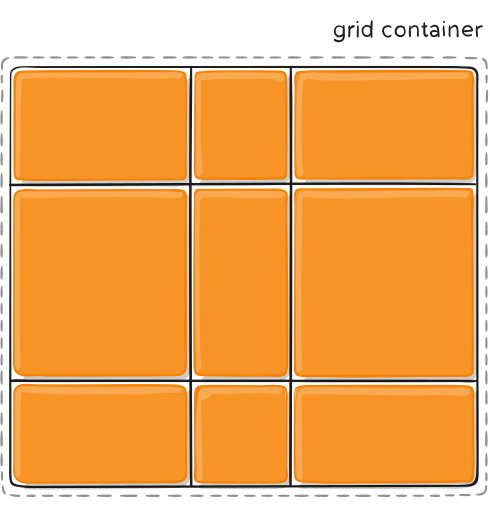
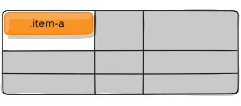

# <span style='color: orangered'>PRACTICE: CSS GRID BASIC 01</span>

## <span style='color: orangered'>Project description</span>

CSS Grid Layout, also known as "Grid" or "CSS Grid", is a two-dimensional grid-based layout system. As of March 2017, most browsers shipped native, unprefixed support for CSS Grid.

The objective of this project is to have a guide for using CSS GRID, with all the properties that are available to us to date and with some practical examples of how we can implement them in our projects.

## <span style='color: orangered'>CSS Grid Terminology</span>

- Grid Container: The element on which display: grid is applied. It’s the direct parent of all the grid items.
- Grid Item: The children, that is, direct descendants of the grid container.
- Grid Line: The dividing lines that make up the structure of the grid. They can be either vertical “column grid lines” or horizontal “row grid lines”.
- Grid Track: The space between two adjacent grid lines. You can think of them as the columns or rows of the grid.
- Grid Area: The total space surrounded by four grid lines. A grid area may be composed of any number of grid cells.
- Grid Cell: The space between two adjacent row and two adjacent column grid lines.


## <span style='color: orangered'>Grid Container (Properties for the Parent)</span>

---

### <span style='color: orangered'>Display Grid</span>

- display: grid | inline-grid;

### <span style='color: orangered'>Grid Template Rows</span>

- grid-template-rows: 50px 50px; -> Create two rows of 50px each
- grid-template-rows: minmax(50px, 1fr) 1fr; -> Example
- grid-template-rows: repeat(5, 1fr) 2fr; -> Example
- grid-template-rows: 50px auto 100px 1fr; -> Example

### <span style='color: orangered'>Grid Template Columns</span>

- grid-template-columns: 100px 100px; -> Create two columns of 100px each
- grid-template-columns: minmax(100px, 1fr) 5rem; -> Example
- grid-template-columns: repeat(5, 20%); -> Example
- grid-template-columns: 100px 10vw auto 1fr; -> Example

### <span style='color: orangered'>Grid Template Rows and Columns (Lines Names)</span>

- grid-template-rows: [line-row1] 1fr [line-row2] 1fr [line-row3]; -> Lines Names (Create two rows of 1fr each)
- grid-template-columns: [line-col1] 1fr [line-col2] 1fr [line-col3]; -> Lines Names (Create two columns of 1fr each)

```css
.grid-container {
  display: grid;
  grid-template-rows: [line-row1] 1fr [line-row2] 1fr [line-row3];
  grid-template-columns: [line-col1] 1fr [line-col2] 1fr [line-col3];
}

.grid-item {
  grid-row: line-row2 / line-row3;
  grid-column: line-col2 / line-col3;
}

/* or similar with grid-area */

.grid-item {
  grid-area: line-row2 / line-col2 / line-row3 / line-col3;
}
```

### <span style='color: orangered'>Grid Template Areas</span>

- grid-template-areas:
  "grid-area-name | . | none | ..."
  "...";

```css
.grid-container {
  display: grid;
  grid-template-columns: 50px 50px 50px 50px;
  grid-template-rows: auto;
  grid-template-areas:
    'header header header header'
    'main main . sidebar'
    'footer footer footer footer';
}

.grid-item-a {
  grid-area: header;
}

.grid-item-b {
  grid-area: main;
}

.grid-item-c {
  grid-area: sidebar;
}

.grid-item-d {
  grid-area: footer;
}
```


### <span style='color: orangered'>Grid Template</span>

A shorthand for setting grid-template-rows, grid-template-columns, and grid-template-areas in a single declaration

- grid-template: none | grid-template-rows / grid-template-columns;

```css
/* grid-template-rows / grid-template-columns */
.grid-container {
  display: grid;
  grid-template: 15% repeat(2, 1fr) 15% / repeat(2, 1fr) auto;
}

/* grid-areas */
.grid-container {
  display: grid;
  grid-template:
    [row1-start] 'header header header' 25px [row1-end]
    [row2-start] 'footer footer footer' 25px [row2-end]
    / auto 50px auto;
}

/* the above (grid-areas) is equivalent to */
.grid-container {
  display: grid;
  grid-template-rows: [row1-start] 25px [row1-end row2-start] 25px [row2-end];
  grid-template-columns: auto 50px auto;
  grid-template-areas:
    'header header header'
    'footer footer footer';
}
```

### <span style='color: orangered'>Gap</span>

- row-gap: 10px;
- column-gap: 5px;
- gap: row-gap column-gap; -> Shorthand


### <span style='color: orangered'>Alignment - The Items (grid cells)</span>

#### <span style='color: orangered'>Align Items</span>

Aligns grid items along the block (column) axis. Aligns with respect to the Grid Cell.

- align-items: start | end | center | stretch;


#### <span style='color: orangered'>Justify Items</span>

Aligns grid items along the inline (row) axis. Aligns with respect to the Grid Cell.

- justify-items: start | end | center | stretch;


#### <span style='color: orangered'>Place Items</span>

Shorthand align-items justify-items

- place-items: center flex-start;

### <span style='color: orangered'>Alignment - The Grid (grid tracks)</span>

#### <span style='color: orangered'>Align Content</span>

Aligns the grid (the complete grid), along the block (column) axis. Aligns with respect to the Grid Container.

- align-content: start | end | center | stretch | space-around | space-between | space-evenly;





#### <span style='color: orangered'>Justify Content</span>

Aligns the grid (the complete grid), along the inline (row) axis. Aligns with respect to the Grid Container.

- justify-content: start | end | center | stretch | space-around | space-between | space-evenly;


#### <span style='color: orangered'>Place Content</span>

Shorthand align-content and justify-content.

- place-content: center flex-start;

### <span style='color: orangered'>Grid Auto Flow</span>

- grid-auto-flow: row | column | row dense | column dense;

If you have grid items that you don’t explicitly place on the grid, the auto-placement algorithm kicks in to automatically place the items. This property controls how the auto-placement algorithm works.

#### grid-auto-flow: row;


#### grid-auto-flow: column;


### <span style='color: orangered'>Grid Auto Rows</span>

Specifies the size of any auto-generated grid tracks (mplicit grid tracks).

- grid-auto-rows: track-size;

### <span style='color: orangered'>Grid Auto Columns</span>

Specifies the size of any auto-generated grid tracks (mplicit grid tracks).

- grid-auto-columns: track-size;

### <span style='color: orangered'>Grid (Shorthand)</span>

Shorthand grid-template-rows, grid-template-columns, grid-template-areas, grid-auto-rows, grid-auto-columns, and grid-auto-flow.

- grid: properties;
- grid: auto-flow dense 100px / 1fr 2fr; -> Example
- grid: 100px 300px / auto-flow 200px; -> Example

## <span style='color: orangered'>Grid Items (Properties for the Children)</span>

---

### <span style='color: orangered'>Grid Column Start and End</span>

- grid-column-start: number | name | span number | span name | auto;
- grid-column-end: number | name | span number | span name | auto;

### <span style='color: orangered'>Grid Row Start and End</span>

- grid-row-start: number | name | span number | span name | auto;
- grid-row-end: number | name | span number | span name | auto;

### <span style='color: orangered'>Grid Column</span>

Shorthand grid-column-start grid-column-end

- grid-column: start-line / end-line | start-line / span value;

### <span style='color: orangered'>Grid Row</span>

Shorthand grid-row-start grid-row-end

- grid-row: start-line / end-line | start-line / span value;

### <span style='color: orangered'>Grid Area</span>

- grid-area: name | row-start / column-start / row-end / column-end;
- grid-area: header; -> Example

### <span style='color: orangered'>Order (Order a specific item)</span>

Order elements taking into account the position within the html file. Default is zero, accepts negative and positive values. The lowest value will be placed first.

- order: 0; -> Defalut value
- order: -1; -> It is placed as the first element regardless of whether it is the last element in the html file.
- order: 1; -> Tt is placed as the last element regardless of whether it is the first in the html file.

```css
.grid-item-latest {
  order: -1; /* would be the first element */
}
```

### <span style='color: orangered'>Alignment (alignment of a specific item)</span>

#### <span style='color: orangered'>Align Self</span>

Aligns a grid item inside a cell along the block (column) axis. This value applies to the content inside a single grid item.

- align-self: start | end | center | stretch;




#### <span style='color: orangered'>Justify Self</span>

Aligns a grid item inside a cell along the inline (row) axis. This value applies to a grid item inside a single cell.

- justify-self: start | end | center | stretch;


#### <span style='color: orangered'>Place Self</span>

Shorthand align-self and justify-self.

- place-self: auto | align-self justify-self;
- place-self: center stretch; -> Example

## <span style='color: orangered'>Special Units and Functions</span>

---

### <span style='color: orangered'>fr units</span>

They essentially mean “portion of the remaining space”.

- grid-template-columns: 1fr 3fr; -> 1 column of 25% and 1 column of 75%

### <span style='color: orangered'>Sizing Keywords</span>

- min-content: the minimum size of the content. Imagine a line of text like “E pluribus unum”, the min-content is likely the width of the word “pluribus”.
- max-content: the maximum size of the content. Imagine the sentence above, the max-content is the length of the whole sentence.
- auto: this keyword is a lot like fr units, except that they “lose” the fight in sizing against fr units when allocating the remaining space.
- fit-content: use the space available, but never less than min-content and never more than max-content.

### <span style='color: orangered'>Sizing Functions</span>

- The minmax() function does exactly what it seems like: it sets a minimum and maximum value for what the length is able to be. This is useful for in combination with relative units. Like you may want a column to be only able to shrink so far.
- grid-template-columns: minmax(100px, 1fr) 3fr; -> Example
- The min() function.
- The max() function.

### <span style='color: orangered'>The repeat() Function and Keywords</span>

The repeat() function can save some typing:

- grid-template-columns: 1fr 1fr 1fr 1fr 1fr 1fr 1fr 1fr;
- grid-template-columns: repeat(8, 1fr);
- grid-template-columns: repeat(8, minmax(10px, 1fr));

But repeat() can get extra fancy when combined with keywords:

- auto-fill: Fit as many possible columns as possible on a row, even if they are empty.
- auto-fit: Fit whatever columns there are into the space. Prefer expanding columns to fill space rather than empty columns.

This bears the most famous snippet in all of CSS Grid and one of the all-time great CSS tricks:

- grid-template-columns: repeat(auto-fit, minmax(250px, 1fr));

### <span style='color: orangered'>Masonry</span>

An experimental feature of CSS grid is masonry layout. Note that there are lots of approaches to CSS masonry, but mostly of them are trickery and either have major downsides or aren’t what you quite expect.

The spec has an official way now, and this is behind a flag in Firefox:

- grid-template-rows: masonry;

### <span style='color: orangered'>Subgrid</span>

Subgrid is an extremely useful feature of grids that allows grid items to have a grid of their own that inherits grid lines from the parent grid.

This is only supported in Firefox right now.

```css
.grid-parent {
  display: grid;
  grid-template-columns: repeat(9, 1fr);
}

.grid-item {
  grid-column: 2 / 7;

  display: grid;
  grid-template-columns: subgrid;
}

.child-of-grid-item {
  /* gets to participate on parent grid! */
  grid-column: 3 / 6;
}
```

## <span style='color: orangered'>Used technology</span>

- Html 5
- CSS

## <span style='color: orangered'>Resources and documentation used</span>

- CSS-TRICKS: https://css-tricks.com/snippets/css/complete-guide-grid/

## <span style='color: orangered'>Developers: Requirements</span>

- Web Browser
- Code editor

## <span style='color: orangered'>Developers: Installtion</span>

1. Clone the repository: https://github.com/newmanferrer/practice-111022-css-grip-01.git
2. Another option is to download the repository using ZIP format.

---

## Author: Newman Ferrer

newmanferrer@gmail.com

:sun_with_face: Maracaibo - Venezuela :venezuela:

Practice date: 11/10/2022
